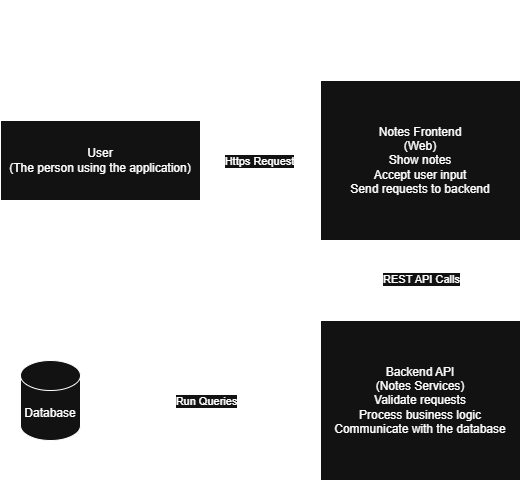

# 🏗️ Notes App - System Design

## 📌 1. Problem Statement

Write what you are building in 1–2 lines.

Example:
Design a Notes Application where users can create, read, update, and delete notes.

---

## 👤 2. Users

- Who will use this system?
- Web users / Mobile users / Admin users

---

## 🎯 3. Functional Requirements

- Requirement 1
- Requirement 2
- Requirement 3
- Add all core features here

---

## ⚙️ 4. Non-Functional Requirements

- Scalability (how big it should grow)
- Performance (how fast it should be)
- Availability (uptime expectations)
- Consistency requirements
- Reliability

---

## 🧠 5. Assumptions

- What you are assuming for simplicity (VERY IMPORTANT)
- Example: single region, small user base, no real-time sync

---

## 🏗️ 6. High-Level Architecture

Add diagram here:

```
User → Frontend → Backend → Database
```

Or insert image:



---

## 🧩 7. Components Breakdown

### Client

What the user interacts with

### Backend

Handles logic, APIs, authentication

### Database

Stores persistent data

### Cache (if any)

Speeds up frequent reads

### Message Queue (if any)

Handles async processing

---

## 🔌 8. API Design

| Method | Endpoint | Description |
| ------ | -------- | ----------- |
| GET    | /api/... | Fetch data  |
| POST   | /api/... | Create data |
| PUT    | /api/... | Update data |
| DELETE | /api/... | Delete data |

---

## 🗄️ 9. Database Design

### Table: Example

| Field      | Type      | Description   |
| ---------- | --------- | ------------- |
| id         | UUID      | Primary Key   |
| name       | String    | Name field    |
| created_at | Timestamp | Creation time |

---

## 🔄 10. Data Flow

Explain step-by-step:

1. User sends request
2. Frontend receives input
3. Backend processes request
4. Database stores/fetches data
5. Response returned to user

---

## 📈 11. Scaling Plan

- What happens if users increase 10x?
- Where are bottlenecks?
- What can be cached?
- Do we need load balancer?
- Do we need multiple servers?

---

## 🔒 12. Security

- Authentication method
- Authorization rules
- Data protection
- Rate limiting (if needed)

---

## ⚠️ 13. Failure Handling

- What if database fails?
- What if server crashes?
- Retry strategy?
- Backup strategy?

---

## 🚀 14. Future Improvements

- Feature 1
- Feature 2
- Feature 3
- Scaling improvements

---

## 🧪 15. Version History

### V01

- Basic working system

### V02

- Improvements added

### V03

- Scaled version

---

## 🧾 16. Learnings

Write what YOU learned from this project:

- Concept 1
- Concept 2
- Mistakes made
- Improvements understood

---

## 🧠 17. Questions I Asked Myself

(Use your `questions.md` checklist here)

- Question 1
- Question 2
- Question 3

---

## 📌 Status

- [ ] V01 Completed
- [ ] V02 In Progress
- [ ] V03 Planned
