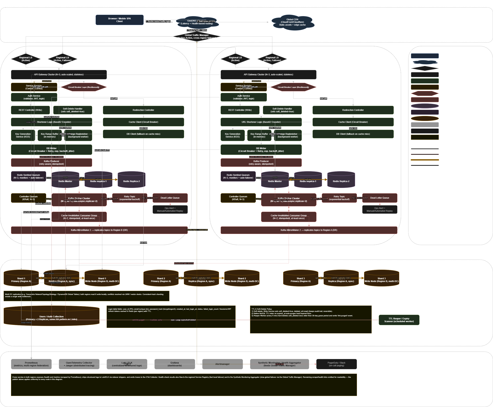
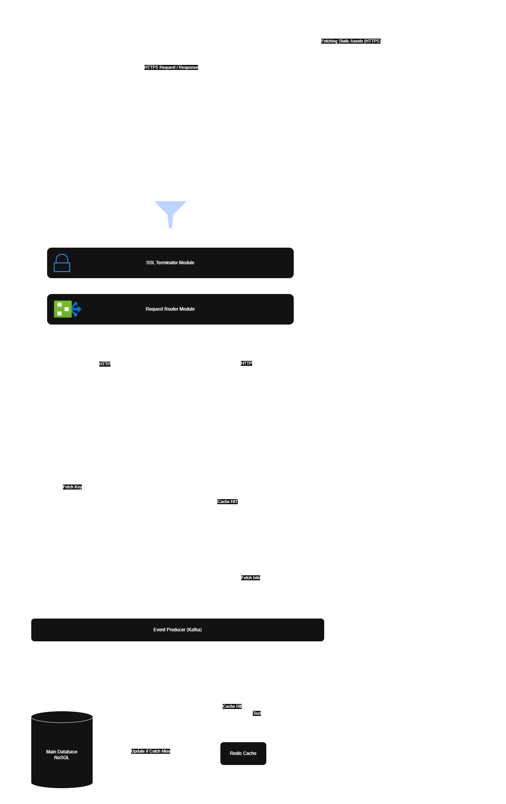
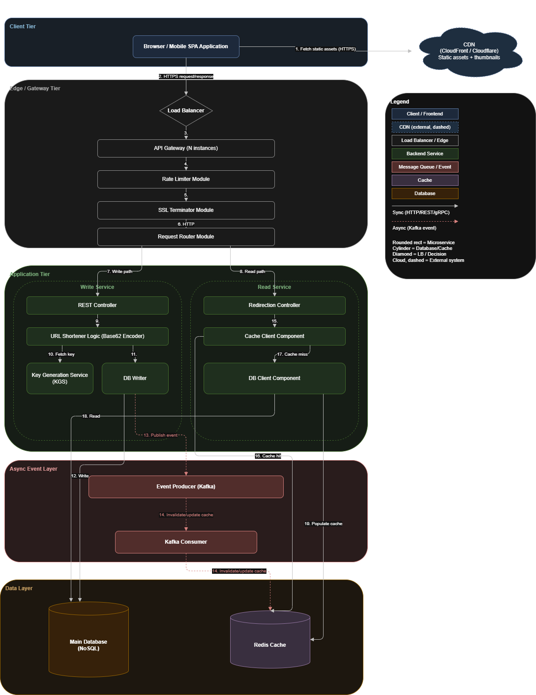

# 🏗️ Global Distributed URL Shortener - System Design

## 📌 1. Problem Statement

Design a highly scalable, fault-tolerant, and globally distributed URL shortening service capable of handling billions of links and trillions of click events with ultra-low latency.

---

## 👤 2. Users

- **Web & Mobile Users:** Worldwide clients creating short links and accessing redirections.
- **Enterprise Users:** High-throughput API clients managing bulk marketing links.
- **Admin/Analytics Users:** System operators and business analysts monitoring traffic patterns.

---

## 🎯 3. Functional Requirements

- **URL Shortening:** Generate a unique, short alias for a given long URL.
- **Redirection:** Instantly redirect users from a short key to the original destination with minimal latency.
- **Custom Aliases:** Allow premium/authenticated users to define custom short links.
- **Expiration Management:** Auto-purge links based on user-defined expiry or guest system limits.
- **Click Analytics:** Capture geo-location, timestamp, referrer, and device metrics for every redirection click event.

---

## ⚙️ 4. Non-Functional Requirements

- **High Availability:** 99.999% uptime with zero Single Point of Failure (SPOF) using multi-region active-active clusters.
- **Ultra-low Latency:** Redirection reads must respond within <20ms using multi-tier global caching (CDN/Redis).
- **Scalability:** Horizontal scaling to sustain 100K+ write QPS and millions of read QPS.
- **Eventual Consistency:** Globally distributed data replication across regions with strong collision avoidance.
- **Fault Tolerance:** Circuit breakers and regional failovers to seamlessly route traffic if an entire data center crashes.

---

## 🧠 5. Assumptions

- **Read/Write Ratio:** Highly read-heavy system (approx. 100:1 read to write ratio).
- **Retention:** Ephemeral guest links expire automatically after 24 hours, while authenticated links are permanent.
- **Global Footprint:** Traffic is distributed across multiple distinct continental hubs (e.g., Region A and Region B).

---

## 🏗️ 6. High-Level Architecture

---

## 🧩 7. Components Breakdown

### Client

Responsive Web Apps and Mobile Browsers that send generation requests or execute redirect lookups.

### Backend (Read & Write Services)

Divided microservices where **Write Services** handle link registration, interacting with a distributed **Key Generation Service (KGS)** to fetch pre-allocated token ranges, while **Read Services** exclusively execute high-speed base62 lookups.

### Database (Sharded NoSQL Cluster)

A horizontally partitioned NoSQL document cluster sharded by `hash(short_code)` across multiple datacenters to provide cross-region active-active write paths.

### Cache (Redis Sentinel & Edge CDN)

Multi-tier caching layer. Global CDNs cache hot redirect locations at the edge, while regional Redis Sentinel clusters protect the underlying NoSQL shards from database read exhaustion on viral URLs.

### Message Queue (Apache Kafka Cluster)

An asynchronous, decoupled ingestion pipeline that streams massive volumes of click tracking events away from the primary OLTP workflow into analytical downstream workers.

---

## 🔌 8. API Design

| Method | Endpoint                     | Description                                                         |
| ------ | ---------------------------- | ------------------------------------------------------------------- |
| POST   | /api/v1/shorten              | Creates a short URL mapping (Accepts custom alias and TTL options). |
| GET    | /:{short_key}                | Core redirection endpoint returning a HTTP 302 Found response.      |
| DELETE | /api/v1/shorten/:short_key   | Explicit removal of an active URL mapping by an authorized user.    |
| GET    | /api/v1/analytics/:short_key | Retrieves high-level tracking summaries for a specific key.         |

---

## 🗄️ 9. Database Design

### Table: Links Collection (Sharded Document Store)

| Field      | Type        | Description                                              |
| ---------- | ----------- | -------------------------------------------------------- |
| short_key  | String (PK) | Base62 unique token generated by KGS.                    |
| long_url   | String      | Original destination web address.                        |
| user_id    | UUID        | Identifies creator (Null for ephemeral/guest links).     |
| created_at | Timestamp   | Creation timezone record.                                |
| expires_at | Timestamp   | Expire flag value utilized by database-level native TTL. |

### Table: Click Logs (OLAP / Columnar Store)

| Field      | Type      | Description                                        |
| ---------- | --------- | -------------------------------------------------- |
| click_id   | UUID (PK) | Unique event identifier.                           |
| short_key  | String    | Associated lookup token (Indexed).                 |
| clicked_at | Timestamp | Exact moment of user activation.                   |
| country    | String    | Resolved country code from user IP (e.g., IN, US). |
| referrer   | String    | Origin platform (e.g., Twitter, Direct).           |

---

## 🔄 10. Data Flow

### The Redirection Flow (Read Path)

1. User clicks a shortened link (`https://lnk.xyz/abcd12`).
2. The **Global Traffic Manager (GTM)** routes the request to the nearest active region based on geo-proximity.
3. Edge **CDN** or regional **Redis Cache** checks for the key `abcd12`. If a cache hit occurs, a `302 Redirect` is sent back immediately.
4. On a cache miss, the **Read Service** queries the targeted **NoSQL Shard**, populates the cache, and serves the redirect.
5. Concurrently, a click event payload is pushed asynchronously to **Apache Kafka** to update metrics without delaying the user.

---

## 📈 11. Scaling Plan

- **Horizontal Microservice Scaling:** Read and Write microservices are stateless and automatically upscale via container orchestrators when CPU metrics cross thresholds.
- **Lock-Free Token Ranges:** The Key Generation Service pre-allocates block segments to distributed nodes, preventing inter-instance write locks or duplicate key collisions.
- **Dedicated OLAP Splitting:** Analytical aggregation workloads are isolated entirely within data warehouses, preventing large metrics aggregation scans from reducing OLTP cluster performance.

---

## 🔒 12. Security

- **Rate Limiting:** IP and Token-based Token Bucket limiters configured at the API Gateway level block malicious bulk extraction.
- **Authentication:** JWT verification implemented on custom alias management endpoints.
- **Input Sanitization:** String sanitization applied on long URL submissions to counter Cross-Site Scripting (XSS) injections.

---

## ⚠️ 13. Failure Handling

- **Database-Level Native TTL:** Replaces legacy resource-heavy batch cleaning operations, ensuring expired keys are reaped continuously without database locking spikes.
- **Circuit Breakers:** Implemented across internal microservice endpoints to instantly isolate failing nodes and activate fallback logic.
- **Active-Active Cross-Region Failover:** If Region A experiences an infrastructure blackout, the GTM dynamically redirects all client payloads to Region B seamlessly.

---

## 🚀 14. Future Improvements

- **Predictive Pre-caching:** Employ machine learning models to analyze creation contexts and proactively inject highly anticipated corporate short links directly into Edge caches before first access.
- **Granular Anti-Phishing Scans:** Introduce asynchronous web scrapers to analyze newly submitted destination targets against verified malware blocklists.

---

## 🧪 15. Version History

### V01

- Standard single-server instance backed by a centralized relational SQL server. Monolithic and prone to single points of failure.

### V02

- Separated standard workflows into explicit Read/Write microservice groups. Introduced horizontal NoSQL sharding and native database TTL logic.

### V03

- Integrated high-tier multi-region Active-Active deployments supported by dynamic GTM geo-routing. Implemented independent lock-free KGS buffers, Kafka telemetry decoupling, and isolated Time-Series health monitoring rings.

---

## 🧾 16. Learnings

- **Consistency vs Availability Trade-offs:** Embraced eventual consistency in data layer synchronization to protect ultra-low latency response windows globally.
- **Decoupled Processing Models:** Understood the crucial importance of offloading system analytical tracking logs out of heavy core transaction runtimes.
- **Continuous Cleanup Benefits:** Discovered that database native TTL tracking outclasses cyclic script cron executors by distributing resource cleanup loads equally across the timeline.

---

## 🧠 17. Questions I Asked Myself

- _How do we bypass massive cross-datacenter sync delays for unique key generation?_ -> Resolved by introducing autonomous region allocation buffers via a specialized KGS.
- _How do we protect our persistent store from being overloaded during sudden viral link click spikes?_ -> Mitigated by routing lookups through localized multi-tier cache lines (CDN + Redis).
- _What happens to operational traffic when large metric calculation jobs are launched?_ -> Completely isolated by moving heavy aggregations out into Kafka-fed OLAP engines.

---

## 📌 Status

- [x] V01 Completed
- [x] V02 Completed
- [x] V03 Completed
