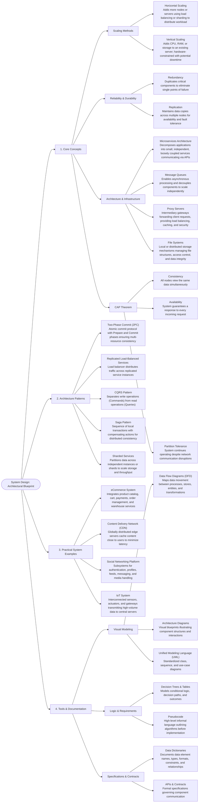
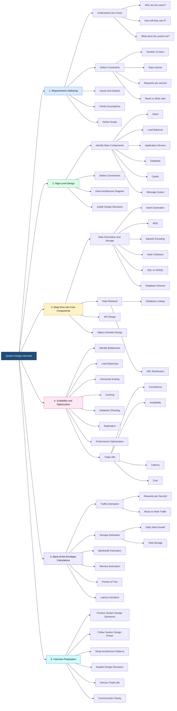

## 1. Introduction

- What is System Design?

```mermaid
flowchart LR
    Root(["System Design: Architectural Blueprint"])
    %% 1. Core Concepts
    Root --> Concepts["1. Core Concepts"]
    Concepts --> Scaling["Scaling Methods"]
    Scaling --> HS["Horizontal Scaling<br/>Adds more nodes or servers using load balancing or sharding to distribute workload"]
    Scaling --> VS["Vertical Scaling<br/>Adds CPU, RAM, or storage to an existing server; hardware-constrained with potential downtime"]
    Concepts --> Reliability["Reliability & Durability"]
    Reliability --> Red["Redundancy<br/>Duplicates critical components to eliminate single points of failure"]
    Reliability --> Rep["Replication<br/>Maintains data copies across multiple nodes for availability and fault tolerance"]
    Concepts --> ArchitectureComm["Architecture & Infrastructure"]
    ArchitectureComm --> MS["Microservices Architecture<br/>Decomposes applications into small, independent, loosely coupled services communicating via APIs"]
    ArchitectureComm --> MQ["Message Queues<br/>Enables asynchronous processing and decouples components to scale independently"]
    ArchitectureComm --> PS["Proxy Servers<br/>Intermediary gateways forwarding client requests, providing load balancing, caching, and security"]
    ArchitectureComm --> FS["File Systems<br/>Local or distributed storage mechanisms managing file structures, access control, and data integrity"]
    Concepts --> CAP["CAP Theorem"]
    CAP --> C["Consistency<br/>All nodes view the same data simultaneously"]
    CAP --> A["Availability<br/>System guarantees a response to every incoming request"]
    CAP --> P["Partition Tolerance<br/>System continues operating despite network communication disruptions"]
    %% 2. Architecture Patterns
    Root --> Patterns["2. Architecture Patterns"]
    Patterns --> TPC["Two-Phase Commit (2PC)<br/>Atomic commit protocol with Prepare and Commit phases ensuring multi-resource consistency"]
    Patterns --> RLBS["Replicated Load-Balanced Services<br/>Load balancer distributes traffic across replicated service instances"]
    Patterns --> CQRS["CQRS Pattern<br/>Separates write operations (Commands) from read operations (Queries)"]
    Patterns --> Saga["Saga Pattern<br/>Sequence of local transactions with compensating actions for distributed consistency"]
    Patterns --> Shard["Sharded Services<br/>Partitions data across independent instances or shards to scale storage and throughput"]
    %% 3. System Examples
    Root --> Examples["3. Practical System Examples"]
    Examples --> ECom["eCommerce System<br/>Integrates product catalog, cart, payments, order management, and warehouse services"]
    Examples --> CDN["Content Delivery Network (CDN)<br/>Globally distributed edge servers cache content close to users to minimize latency"]
    Examples --> Social["Social Networking Platform<br/>Subsystems for authentication, profiles, feeds, messaging, and media handling"]
    Examples --> IoT["IoT System<br/>Interconnected sensors, actuators, and gateways transmitting high-volume data to central servers"]
    %% 4. Tools & Documentation
    Root --> Tools["4. Tools & Documentation"]
    Tools --> Visual["Visual Modeling"]
    Visual --> DFD["Data Flow Diagrams (DFD)<br/>Maps data movement between processes, stores, entities, and transformations"]
    Visual --> ArchDiag["Architecture Diagrams<br/>Visual blueprints illustrating component structures and interactions"]
    Visual --> UML["Unified Modeling Language (UML)<br/>Standardized class, sequence, and use-case diagrams"]
    Tools --> Logic["Logic & Requirements"]
    Logic --> DT["Decision Trees & Tables<br/>Models conditional logic, decision paths, and outcomes"]
    Logic --> Pseudo["Pseudocode<br/>High-level informal language outlining algorithms before implementation"]
    Tools --> Specifications["Specifications & Contracts"]
    Specifications --> DD["Data Dictionaries<br/>Documents data element names, types, formats, constraints, and relationships"]
    Specifications --> APIs["APIs & Contracts<br/>Formal specifications governing component communication"]
```

- How to approach System Design?

```mermaid
flowchart LR
    A["System Design Interview"]
    A --> B["1. Requirements Gathering"]
    B --> B1["Understand Use Cases"]
    B1 --> B11["Who are the users?"]
    B1 --> B12["How will they use it?"]
    B1 --> B13["What does the system do?"]
    B --> B2["Define Constraints"]
    B2 --> B21["Number of users"]
    B2 --> B22["Data volume"]
    B2 --> B23["Requests per second"]
    B2 --> B24["Read vs Write ratio"]
    B --> B3["Inputs and Outputs"]
    B --> B4["Clarify Assumptions"]
    B --> B5["Define Scope"]
    A --> C["2. High-Level Design"]
    C --> C1["Identify Main Components"]
    C1 --> C11["Client"]
    C1 --> C12["Load Balancer"]
    C1 --> C13["Application Servers"]
    C1 --> C14["Database"]
    C1 --> C15["Cache"]
    C1 --> C16["Message Queue"]
    C --> C2["Define Connections"]
    C --> C3["Draw Architecture Diagram"]
    C --> C4["Justify Design Decisions"]
    A --> D["3. Deep Dive into Core Components"]
    D --> D1["Data Generation and Storage"]
    D1 --> D11["Hash Generation"]
    D1 --> D12["MD5"]
    D1 --> D13["Base62 Encoding"]
    D1 --> D14["Hash Collisions"]
    D1 --> D15["SQL vs NoSQL"]
    D1 --> D16["Database Schema"]
    D --> D2["Data Retrieval"]
    D2 --> D21["Database Lookup"]
    D2 --> D22["URL Redirection"]
    D --> D3["API Design"]
    D --> D4["Object-Oriented Design"]
    A --> E["4. Scalability and Optimization"]
    E --> E1["Identify Bottlenecks"]
    E --> E2["Load Balancing"]
    E --> E3["Horizontal Scaling"]
    E --> E4["Caching"]
    E --> E5["Database Sharding"]
    E --> E6["Replication"]
    E --> E7["Performance Optimization"]
    E --> E8["Trade-offs"]
    E8 --> E81["Consistency"]
    E8 --> E82["Availability"]
    E8 --> E83["Latency"]
    E8 --> E84["Cost"]
    A --> F["5. Back-of-the-Envelope Calculations"]
    F --> F1["Traffic Estimation"]
    F1 --> F11["Requests per Second"]
    F1 --> F12["Read vs Write Traffic"]
    F --> F2["Storage Estimation"]
    F2 --> F21["Daily Data Growth"]
    F2 --> F22["Total Storage"]
    F --> F3["Bandwidth Estimation"]
    F --> F4["Memory Estimation"]
    F --> F5["Powers of Two"]
    F --> F6["Latency Numbers"]
    A --> G["6. Interview Preparation"]
    G --> G1["Practice System Design Questions"]
    G --> G2["Follow System Design Primer"]
    G --> G3["Study Architecture Patterns"]
    G --> G4["Explain Design Decisions"]
    G --> G5["Discuss Trade-offs"]
    G --> G6["Communicate Clearly"]
    style A fill:#1f4e79,color:#fff,stroke:#163a5c
    style B fill:#dbeafe,stroke:#2563eb,color:#111
    style C fill:#dcfce7,stroke:#16a34a,color:#111
    style D fill:#fef3c7,stroke:#d97706,color:#111
    style E fill:#fce7f3,stroke:#db2777,color:#111
    style F fill:#ede9fe,stroke:#7c3aed,color:#111
    style G fill:#cffafe,stroke:#0891b2,color:#111
```
